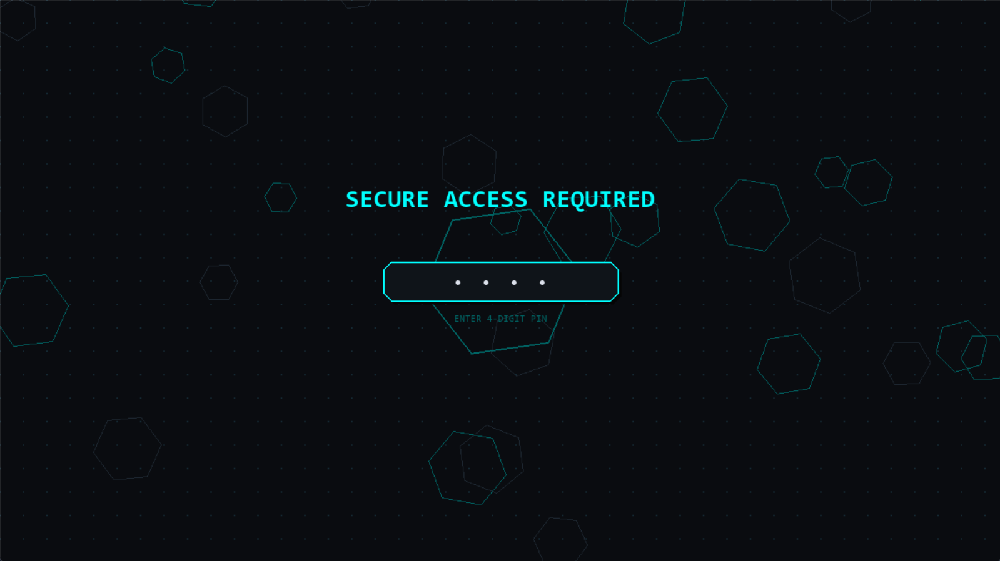
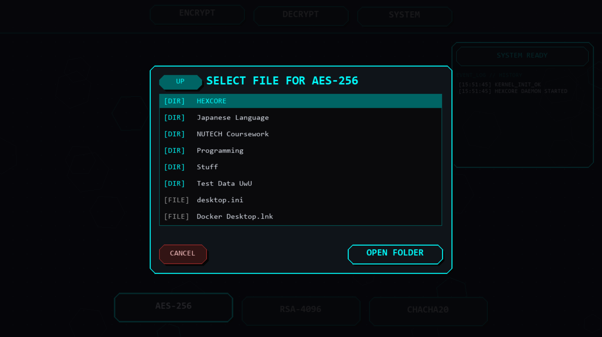
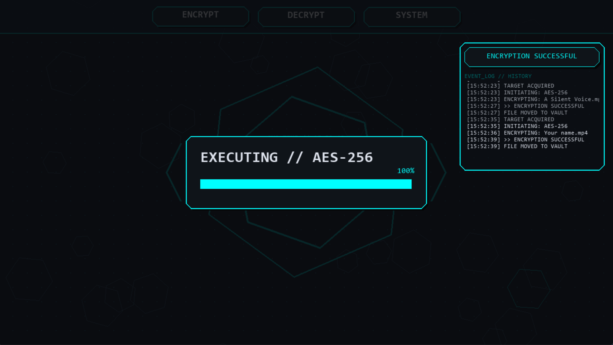

# HEXCORE // SECURE TERMINAL
### "Why do real security tools look so boring?"


> ⚡ **Context:** This entire architecture—from the threaded backend to the custom UI—was engineered and "vibe coded" in a single **72-hour weekend sprint** (for now).

---

## 📸 The Vibe Check

<p align="center">
  
  &nbsp; &nbsp;
  
</p>

<p align="center">
  
</p>

*The UI runs on a separate thread from the encryption logic. This means the animations (floating hexes, progress bars) stay smooth at 60FPS even while the backend is crunching 1GB files.*

---

## 🛠️ Installation & Usage

1.  **Clone the Repository**
    ```bash
    git clone https://github.com/sleepy-archive/HEXCORE.git
    cd HEXCORE
    ```

2.  **Install Dependencies**
    ```bash
    pip install -r requirements.txt
    ```

3.  **Run the System**
    ```bash
    python hex_core.py
    ```

4.  **⚠️ Note:** By default, the app runs in **Demo Mode** (PIN: `1234`).
    * *I know, I know.* Ideally, this should use a secure vault key. But for the sake of checking out the UI without setup friction, I left the training wheels on. You can override this by setting the `HEX_ADMIN_PIN` environment variable.

---

##  Developer's Log

Well, this project was my first ever attempt to create a full-stack application (I'm a freshman), and I mostly "vibe coded" to get my feet wet. But I will be coming back to this project to maintain and heavily modify it. By the time of graduation, I intend for this application to be at least production-grade.

Even the README is vibe coded (sorry not sorry), but hey, it at least gets the point across with nice formatting, don't ya think (even if this text sounds a bit robotic) ??

Also, encrypt or decrypt any data (sensitive or dummy) at your own risk! If you like the UI and want to test *that*, maybe write a dummy backend for the encryption engine, that way you can enjoy the visuals without trusting a freshman's math with your life secrets.

---

## 🗺️ Future Roadmap
I am not abandoning this project. This repo is my long-term testbed for distributed security concepts.

### 🧱 Core & Architecture
- [ ] **Reliability:** Write a unit test script to stress-test 1,000 auto-encrypt/decrypt cycles.
- [ ] **Headless Mode:** Implement `argparse` so the engine runs on Linux servers without a monitor.
- [ ] **Dockerization:** Containerize the backend for one-click deployment across any OS.

### 🌐 Network & Cloud
- [ ] **The Air-Gapped Vault:** Port the backend to a **Raspberry Pi** using a custom raw TCP protocol (avoiding HTTP/Flask overhead).
- [ ] **Database Integration:** Replace text logs with SQLite/PostgreSQL for enterprise-grade audit trails.

### 🛡️ Advanced Security
- [ ] **ML Guard:** Train a model to detect "bot-like" mouse movements and auto-lock the vault.
- [ ] **Red Teaming:** Open the server to peer pentesting to identify and patch real-world exploits.
- [ ] **Hardware Keys:** Experiment with physical key authentication for multi-factor access.

---

## ⚖️ License

Distributed under the MIT License. See `LICENSE` for more information.
